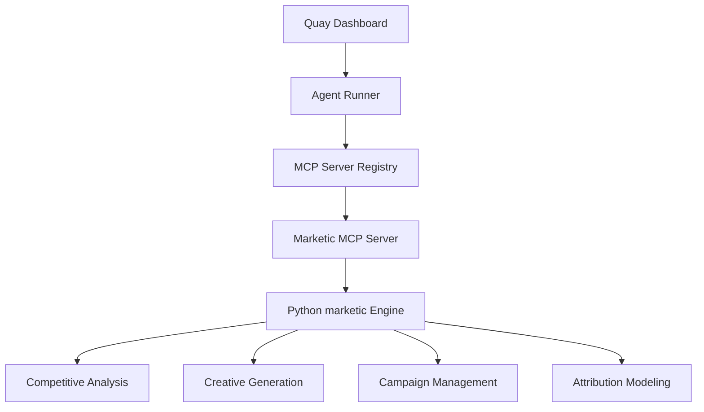

# Quay + Marketic Integration Guide

This document explains how Quay integrates with Marketic to provide built-in marketing intelligence capabilities. The integration uses the Model Context Protocol (MCP) to expose 12 marketing tools directly within Quay's agent ecosystem.

## Architecture Overview



## How It Works

1. **Quay starts** the Marketic MCP server as a child process when the marketing module is enabled
2. **Agent Runner** routes marketing-related queries to Marketic tools via MCP
3. **Marketic processes** requests using domain-specific algorithms (competitive analysis, creative generation, etc.)
4. **Results** return to Quay as structured data, displayed in the marketing dashboard or used in agent responses

## Setup

### Prerequisites

- Python 3.11+ installed on the system
- marketic Python package installed (if using marketing features)
- Quay v0.7.0 or higher

### Installation

1. **Install Marketic (optional)**: Only needed if you want to use the marketing intelligence features
   ```bash
   pip install -e ~/marketic
   ```

2. **Quay will auto-detect** and start the Marketic MCP server when the marketing dashboard is first accessed

### Configuration

Add these environment variables to your `.env`:

```bash
# Marketing database path (optional, defaults to ./marketic_memory.db)
MARKETIC_DB_PATH=./quay_marketing.db

# Enable marketing module features
QUAY_ENABLE_MARKETING=true

# Marketing-specific budget limits (optional)
QUAY_MARKETING_DAILY_BUDGET=100.00
```

## Marketing MCP Tools

### Competitive Analysis

#### `analyze_competitor`
```typescript
// Analyze a competitor
const result = await mcpRegistry.callTool('marketic', 'analyze_competitor', {
  brand: 'HubSpot',
  category: 'marketing automation'
});
/*
Returns:
{
  positioning: {
    name: 'HubSpot',
    tagline: 'Marketing, sales, service software',
    strength: 'Complete ecosystem',
    weakness: 'Complex pricing',
    confidence: 0.92
  },
  gaps: [
    {
      opportunity: 'Simpler pricing',
      difficulty: 'medium',
      market_size: 'large'
    }
  ],
  messaging: {
    positioning: 'The simpler alternative to complex marketing platforms',
    differentiators: [
      'Pricing transparency',
      'Easier onboarding',
      'Focus on core features'
    ]
  }
}
*/
```

#### `compare_competitors`
```typescript
// Compare multiple competitors
const result = await mcpRegistry.callTool('marketic', 'compare_competitors', {
  your_product: 'Quay',
  competitors: ['HubSpot', 'Marketo', 'Pardot']
});
```

### Creative Generation

#### `generate_creatives`
```typescript
// Generate ad copy variants
const result = await mcpRegistry.callTool('marketic', 'generate_creatives', {
  product_name: 'Quay AI Factory',
  product_description: 'Self-hosted AI agents with marketing intelligence',
  channel: 'meta_feed', // google_search, meta_feed, linkedin_sponsored, etc.
  num_variants: 5,
  tone: 'persuasive',
  target_audience: 'Startup founders'
});
/*
Returns Array<{
  variant_id: string;
  channel: string;
  headline: string;
  description: string;
  cta: string;
  hooks: string[];
  confidence: number; // 0-1
  performance_prediction: {
    ctr: number;
    roas: number;
    conversions: number;
  };
}>
*/
```

#### `generate_social_posts`
```typescript
// Generate social media content
const result = await mcpRegistry.callTool('marketic', 'generate_social_posts', {
  topic: 'AI marketing automation',
  platform: 'linkedin', // twitter, instagram, facebook
  format: 'post', // post, thread, carousel
  length: 3,
  hashtags: true
});
```

### Campaign Management

#### `build_campaign`
```typescript
// Build a multi-channel campaign
const result = await mcpRegistry.callTool('marketic', 'build_campaign', {
  product_name: 'Quay AI Factory',
  product_description: 'Self-hosted AI agents with marketing intelligence',
  objective: 'lead_generation', // awareness, traffic, lead_generation, app_installs, purchases
  channels: ['google_search', 'meta_feed', 'linkedin_sponsored'],
  budget_total: 10000,
  duration_days: 30,
  target_audience: 'B2B tech companies'
});
/*
Returns Campaign<{
  name: string;
  objective: string;
  channels: Channel[];
  budget_allocation: {
    [channel]: daily_budget;
  };
  timeline: {
    start: Date;
    end: Date;
    milestones: string[];
  };
  messaging_hierarchy: {
    [stage]: string;
  };
  creative_variants: string[]; // reference to generated variants
}>
*/
```

#### `optimize_budget`
```typescript
// ROAS-based budget rebalancing
const result = await mcpRegistry.callTool('marketic', 'optimize_budget', {
  total_budget: 10000,
  channel_performance: [
    { channel: 'google_search', spend: 5000, roas: 3.5, conversions: 250 },
    { channel: 'meta_feed', spend: 3000, roas: 2.1, conversions: 180 },
    { channel: 'linkedin_sponsored', spend: 2000, roas: 1.8, conversions: 120 }
  ]
});
```

### Performance Analysis

#### `analyze_positioning`
```typescript
// Create positioning map and recommendations
const result = await mcpRegistry.callTool('marketic', 'analyze_positioning', {
  product_name: 'Quay AI Factory',
  product_description: 'Self-hosted AI agents with marketing intelligence',
  category: 'AI/ML platforms',
  competitors: ['HubSpot', 'Salesforce', 'Marketo'],
  target_audience: 'B2B tech companies'
});
/*
Returns {
  positioning_map: {
    x_axis: 'Price',
    y_axis: 'Features',
    quadrants: {
      'high_price_high_features': [Quay, Salesforce],
      'low_price_high_features': [HubSpot],
      'high_price_low_features': [Marketo],
      'low_price_low_features': []
    }
  },
  recommendations: [
    {
      position: 'High Features, Mid-Price',
      tagline: 'Premium AI for everyone',
      rationale: 'Combine Quay\'s ensemble accuracy with accessible pricing'
    }
  ]
}
*/
```

#### `collect_signals`
```typescript
// Collect market intelligence
const result = await mcpRegistry.callTool('marketic', 'collect_signals', {
  sources: ['reddit', 'trends', 'producthunt'],
  subreddits: ['marketing', 'startups', 'technology'],
  query: 'AI marketing automation',
  limit: 50
});
```

#### `get_attribution`
```typescript
// Multi-touch attribution analysis
const result = await mcpRegistry.callTool('marketic', 'get_attribution', {
  channel_points: {
    'google_search': 150,
    'meta_feed': 100,
    'linkedin_sponsored': 75,
    'email': 25
  },
  model: 'shapley' // first_touch, last_touch, linear, time_decay, position_based, shapley
});
```

### Content Generation

#### `generate_seo_content`
```typescript
// Generate SEO-optimized content
const result = await mcpRegistry.callTool('marketic', 'generate_seo_content', {
  keyword: 'AI marketing automation',
  content_type: 'blog_post', // blog_post, landing_page, llm_txt
  word_count: 1500,
  product_name: 'Quay AI Factory',
  product_description: 'Self-hosted AI agents with marketing intelligence'
});
```

#### `generate_narrative`
```typescript
// Generate brand narratives
const result = await mcpRegistry.callTool('marketic', 'generate_narrative', {
  type: 'brand_story', // brand_story, thought_leadership, industry_analysis
  brand: 'Quay AI Factory',
  industry: 'AI/ML',
  audience: 'B2B tech companies'
});
```

### Campaign Launch (HITL Required)

#### `launch_campaign_ad`
```typescript
// Launch campaign ad (requires human approval)
const result = await mcpRegistry.callTool('marketic', 'launch_campaign_ad', {
  platform: 'meta', // meta, linkedin, google
  campaign_name: 'AI Marketing Automation Q3 2024',
  budget_daily: 100,
  ad_creative: JSON.stringify({
    headline: 'AI-Powered Marketing Automation',
    description: 'Quay - Self-hosted AI agents with built-in intelligence',
    image_url: 'https://quay.ai/hero.png'
  }),
  targeting: JSON.stringify({
    age_range: [25, 45],
    interests: ['AI', 'Marketing', 'Startups'],
    location: ['US', 'CA', 'UK']
  })
});
```

## Marketing Pipelines

Quay includes pre-built marketing pipeline templates that orchestrate multiple MCP tools:

### 1. Competitor Counter-Campaign Pipeline
```yaml
# .quay/pipelines/competitor-counter-campaign.yml
name: Competitor Counter-Campaign
description: Analyze competitor and create counter-messaging
stages:
  - name: analyze_competitor
    tool: marketic::analyze_competitor
    inputs: { brand: "{{competitor}}" }
  - name: generate_creatives
    tool: marketic::generate_creatives
    inputs: { channel: "meta_feed", tone: "competitive" }
    depends: [analyze_competitor]
  - name: build_campaign
    tool: marketic::build_campaign
    inputs: { channels: ["google_search", "meta_feed"] }
    depends: [generate_creatives]
```

### 2. Brand Awareness Pipeline
```yaml
# .quay/pipelines/brand-awareness.yml
name: Brand Awareness Campaign
description: Build multi-channel brand awareness campaign
stages:
  - name: generate_narrative
    tool: marketic::generate_narrative
    inputs: { type: "brand_story" }
  - name: generate_social_posts
    tool: marketic::generate_social_posts
    inputs: { platform: "linkedin", format: "thread" }
    depends: [generate_narrative]
  - name: collect_signals
    tool: marketic::collect_signals
    inputs: { sources: ["reddit", "trends"] }
```

### 3. Performance Optimization Pipeline
```yaml
# .quay/pipelines/performance-optimization.yml
name: Performance Optimization
description: Analyze campaign performance and optimize
stages:
  - name: get_attribution
    tool: marketic::get_attribution
    inputs: { channel_points: {...}, model: "shapley" }
  - name: optimize_budget
    tool: marketic::optimize_budget
    inputs: { total_budget: 10000, channel_performance: [...] }
    depends: [get_attribution]
```

## Dashboard Integration

### Marketing Dashboard Routes
- `/marketing` - Main marketing intelligence dashboard
- `/marketing/competitor` - Competitive analysis interface
- `/marketing/creatives` - Creative generator
- `/marketing/campaigns` - Campaign builder and management
- `/marketing/signals` - Market intelligence feed
- `/marketing/performance` - Attribution and analytics

### API Endpoints
```bash
# Marketing Intelligence API
POST   /api/marketing/analyze      # Analyze competitor
POST   /api/marketing/creatives    # Generate ad creatives
POST   /api/marketing/campaign      # Build/launch campaign
POST   /api/marketing/signals      # Collect market signals
GET    /api/marketing/performance   # Attribution data
GET    /api/marketing/positioning   # Positioning analysis
```

## Agent Integration

### Marketing Agent Definition
```typescript
// .quay/agents/marketing.af
{
  "name": "Marketing Intelligence Agent",
  "description": "Competitive analysis, creative generation, campaign management",
  "tools": ["marketic::*"], // All Marketic MCP tools
  "memory": {
    "type": "persistence",
    "maxMemories": 100
  },
  "ensemble": {
    "models": [
      { "provider": "anthropic", "model": "claude-3.5-sonnet", "weight": 0.4 },
      { "provider": "openai", "model": "gpt-4o", "weight": 0.3 },
      { "provider": "google", "model": "gemini-2.5-flash", "weight": 0.3 }
    ],
    "voting": "confidence"
  }
}
```

### Example Usage
```typescript
// Create marketing agent
const marketingAgent = await agentRunner.createAgent(
  './agents/marketing.af'
);

// Run competitor analysis
const result = await marketingAgent.run(
  'Analyze HubSpot positioning and find opportunities',
  { context: 'SaaS B2B marketing automation' }
);

// Result includes competitor analysis, creative suggestions, and campaign recommendations
```

## Troubleshooting

### Common Issues

1. **Marketic MCP Server Not Starting**
   ```bash
   # Check if Marketic is installed
   pip show marketic
   
   # If not installed:
   pip install -e ~/marketic
   ```

2. **Tool Not Found Errors**
   ```bash
   # Verify MCP server registration
   curl http://localhost:3001/api/mcp/tools | jq '.tools[] | select(.name | startswith("marketic"))'
   ```

3. **Memory Database Issues**
   ```bash
   # Reset Marketic database (if needed)
   rm ~/quay_marketing.db
   ```

### Debug Mode
Enable debug logging to troubleshoot issues:
```bash
export QUAY_LOG_LEVEL=debug
bun run dev
```

## Performance Considerations

- **Startup Time**: Marketic adds ~2-3 seconds to cold start
- **Memory Usage**: ~50MB additional for marketing processes
- **API Calls**: Rate limited to 60 requests/minute per tool
- **Storage**: SQLite database grows ~100MB/month with heavy usage

## Future Enhancements

- Browser automation MCP for ad creative testing
- Multi-tenant marketing data isolation
- Advanced attribution models (markov chains, time-based)
- Integration with additional ad platforms (TikTok, Reddit)
- Real-time campaign performance alerts

---

For more information about Marketic, see: https://github.com/Das-rebel/marketic